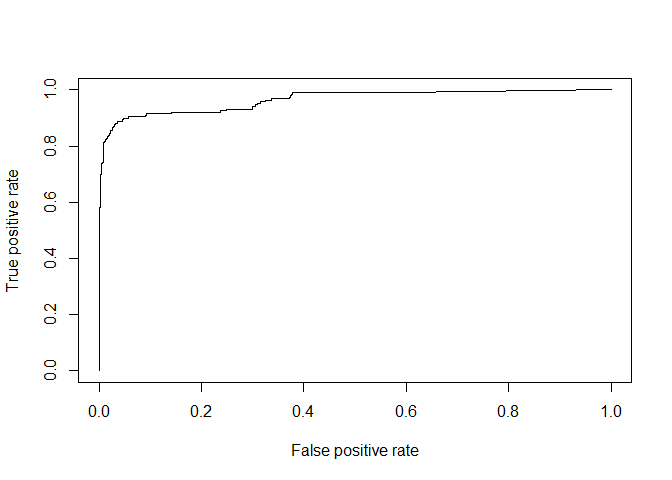
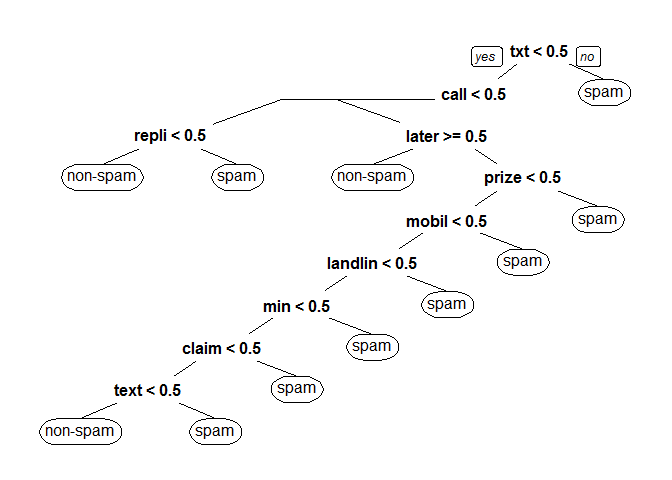
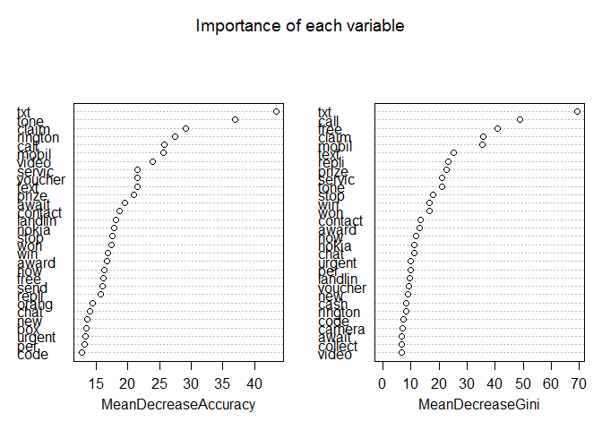
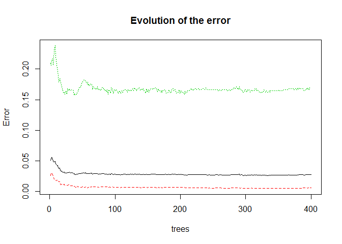
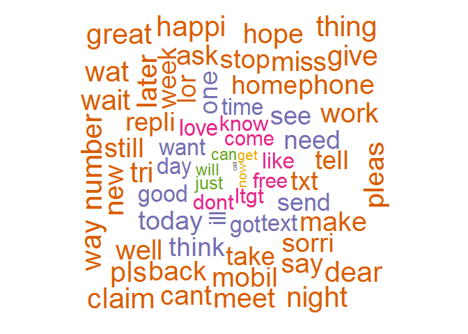

Predicting spam / non-spam
================

Loading Data
------------

``` r
#Get input
sms <- read.csv("spam.csv", stringsAsFactors = F)             
str(sms)
```

    ## 'data.frame':    5572 obs. of  5 variables:
    ##  $ v1 : chr  "ham" "ham" "spam" "ham" ...
    ##  $ v2 : chr  "Go until jurong point, crazy.. Available only in bugis n great world la e buffet... Cine there got amore wat..." "Ok lar... Joking wif u oni..." "Free entry in 2 a wkly comp to win FA Cup final tkts 21st May 2005. Text FA to 87121 to receive entry question(std txt rate)T&C"| __truncated__ "U dun say so early hor... U c already then say..." ...
    ##  $ X  : chr  "" "" "" "" ...
    ##  $ X.1: chr  "" "" "" "" ...
    ##  $ X.2: chr  "" "" "" "" ...

``` r
# remove empty columns
sms$X <- NULL
sms$X.1 <- NULL
sms$X.2 <- NULL

names(sms) <- c("label","message")
levels(as.factor(sms$label))
```

    ## [1] "ham"  "spam"

``` r
sms$label[sms$label == "ham"] <- "non-spam"
sms$label[sms$label == "spam"] <- "spam"

sms$label <- factor(sms$label)
```

Text Analysis
-------------

### Clean text for analysis

``` r
# create bag of words from text
bag <- Corpus(VectorSource(sms$message))
bag <- tm_map(bag, tolower)
bag <- tm_map(bag, PlainTextDocument)
bag <- tm_map(bag, removePunctuation)
bag <- tm_map(bag, removeWords, c(stopwords("english")))
bag <- tm_map(bag, stripWhitespace)
bag <- tm_map(bag, stemDocument)

#Convert bag of words to data frame
frequencies <- DocumentTermMatrix(bag)

# look at words that appear atleast 150 times
findFreqTerms(frequencies, lowfreq = 150)
```

    ##  [1] "back"  "call"  "can"   "come"  "day"   "dont"  "free"  "get"  
    ##  [9] "good"  "got"   "home"  "ill"   "just"  "know"  "like"  "lor"  
    ## [17] "love"  "ltgt"  "mobil" "need"  "now"   "one"   "repli" "see"  
    ## [25] "send"  "sorri" "still" "stop"  "take"  "tell"  "text"  "think"
    ## [33] "time"  "today" "txt"   "want"  "week"  "will"

``` r
sparseWords <- removeSparseTerms(frequencies, 0.995)

# convert the matrix of sparse words to data frame
sparseWords <- as.data.frame(as.matrix(sparseWords))

# rename column names to proper format in order to be used by R
colnames(sparseWords) <- make.names(colnames(sparseWords))
str(sparseWords)
```

    ## 'data.frame':    5572 obs. of  316 variables:
    ##  $ X150ppm  : num  0 0 0 0 0 0 0 0 0 0 ...
    ##  $ X1st     : num  0 0 0 0 0 0 0 0 0 0 ...
    ##  $ X2nd     : num  0 0 0 0 0 0 0 0 0 0 ...
    ##  $ å1000    : num  0 0 0 0 0 0 0 0 0 0 ...
    ##  $ å2000    : num  0 0 0 0 0 0 0 0 0 0 ...
    ##  $ account  : num  0 0 0 0 0 0 0 0 0 0 ...
    ##  $ actual   : num  0 0 0 0 0 0 0 0 0 0 ...
    ##  $ afternoon: num  0 0 0 0 0 0 0 0 0 0 ...
    ##  $ aight    : num  0 0 0 0 0 0 0 0 0 0 ...
    ##  $ alreadi  : num  0 0 0 1 0 0 0 0 0 0 ...
    ##  $ also     : num  0 0 0 0 0 0 0 0 0 0 ...
    ##  $ alway    : num  0 0 0 0 0 0 0 0 0 0 ...
    ##  $ amp      : num  0 0 0 0 0 0 0 0 0 0 ...
    ##  $ anoth    : num  0 0 0 0 0 0 0 0 0 0 ...
    ##  $ answer   : num  0 0 0 0 0 0 0 0 0 0 ...
    ##  $ anyth    : num  0 0 0 0 0 0 0 0 0 0 ...
    ##  $ anyway   : num  0 0 0 0 0 0 0 0 0 0 ...
    ##  $ appli    : num  0 0 1 0 0 0 0 0 0 0 ...
    ##  $ around   : num  0 0 0 0 1 0 0 0 0 0 ...
    ##  $ ask      : num  0 0 0 0 0 0 0 0 0 0 ...
    ##  $ await    : num  0 0 0 0 0 0 0 0 0 0 ...
    ##  $ award    : num  0 0 0 0 0 0 0 0 0 0 ...
    ##  $ babe     : num  0 0 0 0 0 0 0 0 0 0 ...
    ##  $ babi     : num  0 0 0 0 0 0 0 0 0 0 ...
    ##  $ back     : num  0 0 0 0 0 1 0 0 0 0 ...
    ##  $ bad      : num  0 0 0 0 0 0 0 0 0 0 ...
    ##  $ bed      : num  0 0 0 0 0 0 0 0 0 0 ...
    ##  $ best     : num  0 0 0 0 0 0 0 0 0 0 ...
    ##  $ better   : num  0 0 0 0 0 0 0 0 0 0 ...
    ##  $ big      : num  0 0 0 0 0 0 0 0 0 0 ...
    ##  $ birthday : num  0 0 0 0 0 0 0 0 0 0 ...
    ##  $ bit      : num  0 0 0 0 0 0 0 0 0 0 ...
    ##  $ book     : num  0 0 0 0 0 0 0 0 0 0 ...
    ##  $ box      : num  0 0 0 0 0 0 0 0 0 0 ...
    ##  $ boy      : num  0 0 0 0 0 0 0 0 0 0 ...
    ##  $ bring    : num  0 0 0 0 0 0 0 0 0 0 ...
    ##  $ bus      : num  0 0 0 0 0 0 0 0 0 0 ...
    ##  $ buy      : num  0 0 0 0 0 0 0 0 0 0 ...
    ##  $ call     : num  0 0 0 0 0 0 0 0 1 1 ...
    ##  $ camera   : num  0 0 0 0 0 0 0 0 0 1 ...
    ##  $ can      : num  0 0 0 0 0 0 0 0 0 0 ...
    ##  $ cant     : num  0 0 0 0 0 0 0 0 0 0 ...
    ##  $ car      : num  0 0 0 0 0 0 0 0 0 0 ...
    ##  $ care     : num  0 0 0 0 0 0 0 0 0 0 ...
    ##  $ cash     : num  0 0 0 0 0 0 0 0 0 0 ...
    ##  $ chanc    : num  0 0 0 0 0 0 0 0 0 0 ...
    ##  $ chang    : num  0 0 0 0 0 0 0 0 0 0 ...
    ##  $ charg    : num  0 0 0 0 0 0 0 0 0 0 ...
    ##  $ chat     : num  0 0 0 0 0 0 0 0 0 0 ...
    ##  $ check    : num  0 0 0 0 0 0 0 0 0 0 ...
    ##  $ claim    : num  0 0 0 0 0 0 0 0 2 0 ...
    ##  $ class    : num  0 0 0 0 0 0 0 0 0 0 ...
    ##  $ code     : num  0 0 0 0 0 0 0 0 1 0 ...
    ##  $ collect  : num  0 0 0 0 0 0 0 0 0 0 ...
    ##  $ come     : num  0 0 0 0 0 0 0 0 0 0 ...
    ##  $ contact  : num  0 0 0 0 0 0 0 0 0 0 ...
    ##  $ cool     : num  0 0 0 0 0 0 0 0 0 0 ...
    ##  $ cos      : num  0 0 0 0 0 0 0 0 0 0 ...
    ##  $ cost     : num  0 0 0 0 0 0 0 0 0 0 ...
    ##  $ custom   : num  0 0 0 0 0 0 0 0 1 0 ...
    ##  $ dad      : num  0 0 0 0 0 0 0 0 0 0 ...
    ##  $ dat      : num  0 0 0 0 0 0 0 0 0 0 ...
    ##  $ date     : num  0 0 0 0 0 0 0 0 0 0 ...
    ##  $ day      : num  0 0 0 0 0 0 0 0 0 0 ...
    ##  $ dear     : num  0 0 0 0 0 0 0 0 0 0 ...
    ##  $ den      : num  0 0 0 0 0 0 0 0 0 0 ...
    ##  $ detail   : num  0 0 0 0 0 0 0 0 0 0 ...
    ##  $ didnt    : num  0 0 0 0 0 0 0 0 0 0 ...
    ##  $ dinner   : num  0 0 0 0 0 0 0 0 0 0 ...
    ##  $ done     : num  0 0 0 0 0 0 0 0 0 0 ...
    ##  $ dont     : num  0 0 0 0 1 0 0 0 0 0 ...
    ##  $ draw     : num  0 0 0 0 0 0 0 0 0 0 ...
    ##  $ drive    : num  0 0 0 0 0 0 0 0 0 0 ...
    ##  $ dun      : num  0 0 0 1 0 0 0 0 0 0 ...
    ##  $ dunno    : num  0 0 0 0 0 0 0 0 0 0 ...
    ##  $ earli    : num  0 0 0 1 0 0 0 0 0 0 ...
    ##  $ easi     : num  0 0 0 0 0 0 0 0 0 0 ...
    ##  $ eat      : num  0 0 0 0 0 0 0 0 0 0 ...
    ##  $ end      : num  0 0 0 0 0 0 0 0 0 0 ...
    ##  $ enjoy    : num  0 0 0 0 0 0 0 0 0 0 ...
    ##  $ enough   : num  0 0 0 0 0 0 0 0 0 0 ...
    ##  $ even     : num  0 0 0 0 0 0 1 0 0 0 ...
    ##  $ ever     : num  0 0 0 0 0 0 0 0 0 0 ...
    ##  $ everi    : num  0 0 0 0 0 0 0 0 0 0 ...
    ##  $ everyth  : num  0 0 0 0 0 0 0 0 0 0 ...
    ##  $ feel     : num  0 0 0 0 0 0 0 0 0 0 ...
    ##  $ final    : num  0 0 1 0 0 0 0 0 0 0 ...
    ##  $ find     : num  0 0 0 0 0 0 0 0 0 0 ...
    ##  $ fine     : num  0 0 0 0 0 0 0 0 0 0 ...
    ##  $ finish   : num  0 0 0 0 0 0 0 0 0 0 ...
    ##  $ first    : num  0 0 0 0 0 0 0 0 0 0 ...
    ##  $ forgot   : num  0 0 0 0 0 0 0 0 0 0 ...
    ##  $ free     : num  0 0 1 0 0 0 0 0 0 2 ...
    ##  $ friend   : num  0 0 0 0 0 0 0 1 0 0 ...
    ##  $ fuck     : num  0 0 0 0 0 0 0 0 0 0 ...
    ##  $ fun      : num  0 0 0 0 0 1 0 0 0 0 ...
    ##  $ game     : num  0 0 0 0 0 0 0 0 0 0 ...
    ##  $ get      : num  0 0 0 0 0 0 0 0 0 0 ...
    ##  $ girl     : num  0 0 0 0 0 0 0 0 0 0 ...
    ##   [list output truncated]

``` r
sparseWords$label <- sms$label
```

Predicting whether SMS is spam / non-spam
-----------------------------------------

split data into 75:25 and assign to train and test.

We will develop the model on train and check the accuracy on train

``` r
set.seed(256)
split <- sample.split(sparseWords$label, SplitRatio = 0.75)
train <- subset(sparseWords, split == T)
test <- subset(sparseWords, split == F)
```

### Baseline Model(predicting every message as non-spam)

``` r
table(test$label)
```

    ## 
    ## non-spam     spam 
    ##     1206      187

``` r
print(paste("Predicting all messages as non-spam gives an accuracy of: ",
            100*round(table(test$label)[1]/nrow(test), 4), "%"))
```

    ## [1] "Predicting all messages as non-spam gives an accuracy of:  86.58 %"

Logistic Regression Model
-------------------------

``` r
glm.model <- glm(label ~ ., data = train, family = "binomial")
```

    ## Warning: glm.fit: fitted probabilities numerically 0 or 1 occurred

``` r
glm.predict <- predict(glm.model, test, type = "response")

### ROC curve
glm.ROCR <- prediction(glm.predict, test$label)
print(glm.AUC <- as.numeric(performance(glm.ROCR,"auc")@y.values))
```

    ## [1] 0.96358

``` r
glm.prediction <- prediction(abs(glm.predict), test$label)
glm.performance <- performance(glm.prediction,"tpr","fpr")
plot(glm.performance)
```



``` r
### selecting threshold = 0.75 for spam filtering
table(test$label, glm.predict > 0.9)
```

    ##           
    ##            FALSE TRUE
    ##   non-spam  1195   11
    ##   spam        37  150

``` r
glm.accuracy.table <- as.data.frame(table(test$label, glm.predict > 0.9))
print(paste("logistic model accuracy:",
            100*round(((glm.accuracy.table$Freq[1]+glm.accuracy.table$Freq[4])/nrow(test)), 4),
            "%"))
```

    ## [1] "logistic model accuracy: 96.55 %"

Support Vector Machine Model
----------------------------

``` r
svm.model <- svm(label ~ ., data = train, kernel = "linear", cost = 0.1, gamma = 0.1)
svm.predict <- predict(svm.model, test)
table(test$label, svm.predict)
```

    ##           svm.predict
    ##            non-spam spam
    ##   non-spam     1191   15
    ##   spam           27  160

``` r
svm.accuracy.table <- as.data.frame(table(test$label, svm.predict))
print(paste("SVM accuracy:",
            100*round(((svm.accuracy.table$Freq[1]+svm.accuracy.table$Freq[4])/nrow(test)), 4),
            "%"))
```

    ## [1] "SVM accuracy: 96.98 %"

Decision Trees
--------------

``` r
tree.model <- rpart(label ~ ., data = train, method = "class", minbucket = 15)
# visualize the decision tree. It tells us about significant words.
prp(tree.model) 
```



``` r
tree.predict <- predict(tree.model, test, type = "class")
table(test$label, tree.predict)
```

    ##           tree.predict
    ##            non-spam spam
    ##   non-spam     1179   27
    ##   spam           94   93

``` r
rpart.accuracy.table <- as.data.frame(table(test$label, tree.predict))
print(paste("rpart (decision tree) accuracy:",
            100*round(((rpart.accuracy.table$Freq[1]+rpart.accuracy.table$Freq[4])/nrow(test)), 4),
            "%"))
```

    ## [1] "rpart (decision tree) accuracy: 91.31 %"

Random Forest
-------------

``` r
set.seed(256)
rf.model <- randomForest(label ~ ., data = train, ntree=400, mtry=15, importance=T)

# Importance  tells us about significant words.
importance(rf.model)
```

    ##               non-spam         spam MeanDecreaseAccuracy MeanDecreaseGini
    ## X150ppm    9.694210532  5.280160376         10.041123080      4.551990138
    ## X1st       6.810367659  7.001923439          8.027241296      2.609979612
    ## X2nd       2.503244128  2.553007037          3.455317991      0.681649960
    ## å1000     11.818555789  3.995476553         11.810710376      4.560093982
    ## å2000      4.348068078  2.069500069          4.569785785      1.305798531
    ## account    6.035519326  8.809787501          9.256423026      3.377397314
    ## actual     1.001252349  1.417745622          1.738566709      0.153075668
    ## afternoon  2.669041334  0.000000000          2.669152788      0.124919377
    ## aight      1.511412837  1.001252349          1.740534124      0.396955952
    ## alreadi    0.972090062  1.950813604          2.188108010      0.195005890
    ## also      -0.959086157  1.735261833         -0.540453251      0.722752994
    ## alway      3.011146177  2.666440191          4.000501116      0.359940602
    ## amp        5.181809984  3.158329412          5.051825683      0.599659194
    ## anoth      0.638086839  2.464855966          1.910214216      0.243569030
    ## answer    -0.891282714  3.400044038          2.774366591      0.466340893
    ## anyth      0.002402497  1.001252349          0.591847707      0.085919814
    ## anyway     0.000000000  0.000000000          0.000000000      0.005396313
    ## appli      9.670475394  3.962372371          9.167172052      4.225351892
    ## around     2.339434722  2.668779099          3.345308327      0.333610082
    ## ask        1.546285489  2.429878419          2.610541408      0.966623631
    ## await     19.159118348 12.662902022         19.585080151      6.801283263
    ## award     15.636479109 12.709440411         16.781851672     13.228193016
    ## babe       1.683169700  1.407634212          2.104272631      0.304712211
    ## babi      -2.208412665  0.000000000         -2.205488875      0.364568372
    ## back       1.563190453  5.076435181          4.630264010      1.545129035
    ## bad       -3.046841298  1.001252349         -2.834125162      0.448620782
    ## bed        0.000000000  1.001252349          1.001252349      0.057306846
    ## best      -0.307986181  3.658305124          2.462536174      0.279643040
    ## better     2.250061084  0.000000000          2.250087701      0.162518127
    ## big        2.344037492  0.000000000          2.340592670      0.178154161
    ## birthday   0.000000000  0.000000000          0.000000000      0.037731491
    ## bit       -1.130335080  3.032095082          1.503008558      0.284138051
    ## book      -1.901580201  4.081994744          0.835591895      0.829881637
    ## box       12.822980561  9.589335484         13.540150693      6.481992242
    ## boy       -0.012664094  1.416668033          0.996733629      0.171722211
    ## bring      0.000000000 -1.001252349         -1.001252349      0.079199132
    ## bus        1.503690933  0.000000000          1.502281341      0.144974670
    ## buy       -2.366672972 -0.426950197         -2.088187587      0.282396914
    ## call      15.677698264 25.215021513         25.815796354     48.784078316
    ## camera     9.004069938 10.838152650         11.591127687      7.006447979
    ## can        3.295495340  7.556096759          7.256185484      3.417647446
    ## cant       5.061665382  4.960938370          6.570178686      0.995607954
    ## car        0.980295143  1.732507658          1.887418906      0.107535875
    ## care       1.014523566  3.223385317          2.509639018      0.315872336
    ## cash       9.391898242  5.185329115          9.559529776      8.389028782
    ## chanc      5.741436181  4.826724805          6.333466003      2.896792075
    ## chang      0.005885817  1.001252349          0.821985106      0.076999836
    ## charg     10.563213560  6.275959088         10.634195905      3.506150976
    ## chat      11.631652900 13.644084672         13.989521083     11.318351482
    ## check     -0.362153278  1.736422453          0.178140351      0.361500651
    ## claim     28.305778109 19.360342358         29.100868430     35.707848558
    ## class     -1.001252349  1.001252349          0.000000000      0.069509897
    ## code      12.217461725  9.229415679         12.764758121      7.222747656
    ## collect    8.222070731  6.681700901          8.999627078      6.798323058
    ## come      -2.715698976  5.159670073          2.291487866      1.054058123
    ## contact   15.868679924 19.335429186         18.678475204     13.563269361
    ## cool       0.009147190  1.001252349          0.380766261      0.308487310
    ## cos       -0.568894235  2.931925713          2.323321925      0.171965679
    ## cost      12.981194361  4.982233723         12.494246731      3.609639916
    ## custom     6.127165508  7.901916283          7.668384855      5.957664609
    ## dad        0.000000000  0.000000000          0.000000000      0.025364948
    ## dat        0.578770497  2.249774647          2.137027278      0.193852219
    ## date       5.682491773  6.189711340          7.244471059      4.040575603
    ## day        1.215857622  6.368259361          4.519371726      1.581221915
    ## dear       0.931392279  1.305300363          1.451721547      0.807841563
    ## den        0.000000000  0.000000000          0.000000000      0.012837779
    ## detail     1.724612234  0.403362111          1.728615847      0.306748923
    ## didnt      2.332319199  2.405388324          3.038007325      0.342446203
    ## dinner     1.001252349  0.000000000          1.001252349      0.011268218
    ## done      -1.001252349  0.000000000         -1.001252349      0.028407861
    ## dont       0.662415808  8.859697402          6.351781287      2.098045601
    ## draw       9.818192408  3.505943425          9.946790776      5.115706453
    ## drive      1.001252349  1.001252349          1.417635440      0.050073237
    ## dun        0.000000000  0.000000000          0.000000000      0.041619362
    ## dunno     -1.417624896  0.000000000         -1.417684910      0.077466372
    ## earli      0.000000000  0.000000000          0.000000000      0.018011755
    ## easi       4.238591920  0.790227932          3.757328888      0.761319490
    ## eat        0.000000000  1.001252349          1.001252349      0.033125670
    ## end        4.543249017  7.432633384          7.952658019      1.807598008
    ## enjoy     -1.157818570 -0.001587839         -0.975129251      0.542228397
    ## enough     0.975310944 -0.056617872          0.951089023      0.533524911
    ## even      -1.149827270  1.152342808         -0.386526976      0.929266628
    ## ever       0.019573855  0.000000000          0.010998090      0.142090408
    ## everi      3.228947405  6.491368838          5.799458275      2.451828641
    ## everyth    0.000000000  1.001252349          1.001252349      0.054014548
    ## feel       2.128878540  2.665312017          3.018131238      0.235923553
    ## final      1.748376468  1.833214583          2.413044576      0.638462591
    ## find      -0.530118974  4.295126410          2.293180358      0.886439813
    ## fine       0.000000000  0.000000000          0.000000000      0.026401239
    ## finish    -1.738425898  1.417642263         -0.455391613      0.312600237
    ## first     -1.141443768  3.468956091          0.751872651      0.503156586
    ## forgot     0.017024669  2.001786004          1.640150030      0.129247241
    ## free      11.931416861 19.433919167         16.169570742     40.938094843
    ## friend     0.162097284  5.031567625          3.814095486      1.207510260
    ## fuck      -0.590880242  1.001252349         -0.012880638      0.044197702
    ## fun       -0.603201703  4.531101455          2.694598474      1.172859494
    ## game       6.406602381  6.144755866          8.088744950      3.020580947
    ## get       -0.894023471  6.641108665          4.189437724      2.781109233
    ## girl      -0.675084288  1.913790765          0.082847551      1.091032240
    ## give      -0.162697406  1.649740668          0.764912863      0.589775655
    ## god        0.000000000  0.000000000          0.000000000      0.066863614
    ## gonna      1.417536143  1.737680124          2.249929745      0.169308442
    ## good       3.953941596  2.240823187          4.479508804      1.203160308
    ## got       -0.350752780  6.115489285          3.729387333      1.277424316
    ## great      1.342598368 -0.212405677          0.962671362      0.732346319
    ## guarante  11.929365610  4.608217444         12.187651963      6.063526154
    ## gud       -1.001252349  2.249436938          1.639539125      0.142294034
    ## guess      0.164852475  1.057531426          0.487255080      0.502933156
    ## guy        1.370260967  4.651543236          3.852860068      0.565106748
    ## haha       0.000000000  1.417600523          1.417714951      0.053081807
    ## half       3.017685143  3.910609736          4.449612791      0.804838760
    ## happen    -0.026165298  0.000000000         -0.018187745      0.075232763
    ## happi      2.158507480  0.629248646          2.221427444      0.262817767
    ## havent    -1.001252349  0.351123671         -0.018120287      0.068941758
    ## hear      -1.001252349  1.562141058          0.763881229      0.277620544
    ## heart      0.319126079  3.359648999          2.581806191      0.203105246
    ## hello     -0.669630720  2.107557397          0.033723965      0.698175551
    ## help       4.042612524  6.495989840          6.527516710      1.868612189
    ## hes        0.000000000  1.001252349          1.001252349      0.084311533
    ## hey        0.602587299  1.418865056          1.228552519      0.741443770
    ## holiday    6.698812759  6.117292532          7.611594910      3.248635320
    ## home       1.276522254  3.842934195          3.133071791      0.447411164
    ## hope       0.523838736  3.394568923          2.827002020      0.658674352
    ## hour       2.466107226  2.136549918          2.874034943      0.160599901
    ## hous       2.009823462  0.000000000          2.009826928      0.071040416
    ## how        0.000000000  0.000000000          0.000000000      0.014475052
    ## hurt       1.001252349  1.001252349          1.417740999      0.082364324
    ## ill        2.915584312  9.318967056          9.108797194      2.888798407
    ## ive        1.379934007  3.872612756          3.508687463      0.577329402
    ## job       -0.583787274  1.001252349         -0.011432502      0.095774933
    ## join       2.577578147  3.872124546          4.582614041      1.868835015
    ## jus       -0.017011871  0.000000000         -0.004171703      0.070367446
    ## just       0.676170905  5.286935350          3.932430482      2.299293813
    ## keep       1.002131467 -0.283694624          0.480380208      0.331399815
    ## kiss       0.973780188  0.000000000          0.981647759      0.060203857
    ## know       1.247533725  7.220751325          6.361550906      1.650256328
    ## landlin   17.566804530 11.443380279         18.125444053      9.485783202
    ## lar        0.000000000  0.000000000          0.000000000      0.020598861
    ## last       1.731399746  2.503042743          2.764344297      0.378346765
    ## late       5.550069112 -1.042815212          4.838773927      0.873150636
    ## later      3.759571831  6.827275471          7.008844334      2.166344999
    ## latest    10.578093959  7.956189203         12.122491031      4.846538962
    ## leav      -3.238911153  2.006606760         -2.655884589      0.353304790
    ## left      -1.548653212  0.787458930         -1.021587449      0.378565253
    ## leh        0.000000000  0.000000000          0.000000000      0.020204540
    ## let        0.150556752  5.152775797          4.417184041      0.869924334
    ## liao       1.001252349  0.000000000          1.001252349      0.078698892
    ## life       0.477302110  0.819322441          0.765075506      0.289818936
    ## like      -0.973543815  3.126885053          0.891199095      1.075502373
    ## line       5.186014968  5.358023443          6.495004167      3.372929119
    ## littl      1.382058121  0.017900011          1.339428439      0.553997344
    ## live       2.696759995  3.372624298          4.336431241      1.261990598
    ## lol        1.140207505  2.182096685          2.424957552      0.189967669
    ## long       2.194679796  2.249331362          2.659112825      0.364673565
    ## look      -2.265680194 10.627329738          9.061786857      1.365959341
    ## lor       -0.907243926  3.098464836          1.955662286      0.294824331
    ## lot        0.845301883  1.417651658          1.302975689      0.274664070
    ## love       3.281123661  3.413553119          4.644800317      1.229142445
    ## ltgt       7.117126577  8.259372658          9.275435199      2.305698085
    ## lunch      1.639378168  1.001252349          1.897673000      0.061240504
    ## luv        2.733816743  3.560443451          4.210581526      0.625422315
    ## make       2.688746255  8.499259847          8.487396268      1.520354595
    ## man        1.133639465  2.009325165          2.122787263      0.332019309
    ## mani       1.551392502 -1.001252349          1.367280725      0.482204804
    ## mate       1.608940017  6.447363724          5.769358517      1.128973468
    ## may        1.067417727  1.909593712          1.886610922      0.292923811
    ## mayb      -1.001252349  1.001252349         -0.008232670      0.019337225
    ## mean       1.891881246  1.417645921          2.340652774      0.094985879
    ## meet      -1.803782958  1.145356671          0.229663934      0.633122245
    ## messag     6.510330197 11.792383095         12.138446032      5.633593636
    ## might      0.000000000  1.417698405          1.417583869      0.123785462
    ## min        4.097383109  9.588104137          7.949823835      4.379333484
    ## mind       1.116218216  5.240127737          4.037729601      0.668638059
    ## minut     -0.206125821 -0.009619181         -0.139425888      0.234250839
    ## miss      -2.706946721  7.730186619          2.203811844      0.995936094
    ## mobil     24.784786406 20.931428931         25.673699223     35.253682362
    ## money     -0.585712613  1.416670885          0.444053864      0.299487321
    ## month      1.272919359  1.082670191          1.635259563      0.611160664
    ## morn       0.632755072  2.009900742          1.609020882      0.180242918
    ## msg        4.333471680  4.876312861          6.055782072      2.061108030
    ## much       1.959171030  0.987303745          2.231571394      0.328824594
    ## name      -0.031981761  1.794623286          1.799772702      0.804926925
    ## need       0.905892020  1.590319345          1.599107314      1.134729427
    ## network    8.093341592  7.763742989          9.250336500      3.134554323
    ## never      1.417612346  1.001252349          1.738431547      0.256083830
    ## new        8.484383440 15.369310198         13.655566278      8.912497460
    ## next.      3.956068215  4.327644766          5.855591889      2.811664470
    ## nice      -0.810915817  1.417493868         -0.003614449      0.204582930
    ## night      0.758216484  1.711155233          1.351494009      0.802761264
    ## nokia     17.571660241  9.866912129         17.918081515     11.322734577
    ## noth      -0.399145550  0.047796463         -0.315204520      0.117654392
    ## now        5.795340850 17.054112717         16.347220076     11.760063895
    ## number     2.793734529  4.884784809          4.815713651      1.598342589
    ## offer      6.203049927  8.106790644          7.923927897      2.665803643
    ## one       -1.324955994  3.189898195          0.993163303      1.018520546
    ## orang     13.332504905  8.439318646         14.444365979      4.862859328
    ## pain      -1.001252349  0.000000000         -1.001252349      0.053447108
    ## part       0.272987051  4.257420660          3.857247119      0.512759081
    ## pay       -2.449388184  0.533383601         -2.240732312      0.491425145
    ## peopl     -0.270323662  1.061914498          0.131754768      0.472504403
    ## per       11.344897085 13.375254991         13.153540737      9.845194377
    ## person     4.939471383  1.693815921          4.847689370      0.503318960
    ## phone      2.652002586  5.018400905          5.096982440      2.383416337
    ## pick       3.520165904  2.234308323          3.933781937      0.652789610
    ## place      2.839438102  2.523889309          3.756161590      0.826671579
    ## plan       0.000000000  1.415065716          1.417738266      0.129675326
    ## play       3.985256142  7.788981711          8.023974936      2.827480926
    ## pleas     -4.090524644  9.235050938          5.421585475      3.930372930
    ## pls        4.623087315  3.033129827          5.226640947      0.953611669
    ## point      3.467865950  8.599812276          8.393418551      2.006897897
    ## pound      8.932116712  9.690093842         10.703845278      4.087495353
    ## princess   0.000000000  0.000000000          0.000000000      0.053374253
    ## prize     20.418822151 12.391204936         20.981727287     22.763916849
    ## probabl   -1.417736361  0.000000000         -1.417753198      0.138666118
    ## problem    2.549094540  1.417762410          2.875863779      0.427620723
    ## put        2.747149652  1.417745622          2.981594193      0.434589102
    ## question   1.192178484  1.674618421          1.922165655      0.990051020
    ## quit       0.000000000  2.249721211          2.250062545      0.258511454
    ## rate       9.743379562  6.622749451         10.529732037      4.652573768
    ## reach      1.336871738  2.130439123          2.239667015      0.211604270
    ## readi     -1.110480636  3.349732000          1.569218549      0.665018364
    ## real      -1.031762998  4.848750279          2.343334909      0.987734292
    ## realli     1.150738582 -0.568632947          0.652036359      0.186338355
    ## receiv     6.279741804  5.410090198          7.100139900      3.033507242
    ## rememb    -1.001252349  1.001252349         -0.005481407      0.007423932
    ## repli     10.709174022 20.987987551         15.746288502     23.271941869
    ## right      5.204656426  0.598552990          5.254433433      0.415921654
    ## rington   28.364001035 12.961545168         27.438190865      8.276977013
    ## room      -1.144012588  1.001252349         -0.720208044      0.224220911
    ## run        1.724763406  1.348634296          2.080373267      0.479502364
    ## said       1.005932135  2.009705146          1.907926815      0.199777095
    ## sat        1.163202628 -0.487611697          0.824464528      0.396681076
    ## say        3.272913056  3.878177615          4.383655753      0.360552625
    ## see       -0.285301748  5.090314850          3.736881117      1.541534431
    ## select    11.894527262  7.713659496         12.189409466      5.033774744
    ## send       6.124886492 16.195653418         16.016494315      6.226097237
    ## sent       0.893975728  4.600840761          3.072946050      1.259480215
    ## servic    18.418500392 20.743683882         21.554640193     21.113773952
    ## shall     -1.417759868  0.000000000         -1.417745235      0.127306796
    ## shit       1.083055476 -1.737340651          0.286893210      0.250837878
    ## shop      -0.153086968 -0.889793276         -0.591262143      0.510650856
    ## show       1.830875011  7.936928275          7.507929887      2.700464344
    ## sir        4.074513926  2.754269735          4.652963602      0.611198526
    ## sleep      1.628701457  2.735164999          2.973348590      0.184114630
    ## smile      1.001252349  0.000000000          1.001252349      0.082191163
    ## sms       10.436505240  6.358107444         10.918132921      3.660506155
    ## someon    -0.174776426  3.245740038          2.524798685      0.576939443
    ## someth     0.812862786  3.737028727          3.222612827      0.334932437
    ## soon      -1.001252349  0.000000000         -1.001252349      0.115911992
    ## sorri      3.043755901  4.921434094          5.323456743      1.481948592
    ## speak      2.250024935  2.357945235          3.025611506      0.583835119
    ## special    4.305439365  6.967413568          6.939232014      2.013645393
    ## start     -3.215020170  5.100547733          1.383116434      0.983409705
    ## stay       0.271110440  0.355191979          0.398454522      0.450987715
    ## still      3.792575618  4.208604342          5.112325096      0.864403899
    ## stop       9.403050636 21.229200898         17.580095268     17.823950129
    ## stuff      0.000000000  1.001252349          1.001252349      0.051946979
    ## sure      -0.281618322  2.351848580          1.511573879      0.195111901
    ## sweet     -1.001252349  2.361274983          1.910007033      0.121868882
    ## take       1.346554229  2.905668812          2.661751851      1.338199055
    ## talk       0.002933684  2.246478534          1.049357487      0.444986629
    ## tcs        8.949416890  3.736984227          9.062232648      2.772029180
    ## tell       1.087875758  2.644861623          2.776651589      0.786541083
    ## text      14.453729907 21.634955455         21.519557642     25.255226250
    ## thank     -2.292197705  2.764105013         -0.395173748      0.557134102
    ## thanx     -0.583992007  0.000000000         -0.583403416      0.011674075
    ## that       1.024105920  1.626280812          1.960867796      0.310119669
    ## there      1.247843192  3.221591577          2.691701564      0.359675820
    ## thing     -0.198833054  5.538985489          4.369077888      0.553974507
    ## think      0.007959459  9.539911258          8.417972237      1.535915177
    ## thk        1.001252349  1.732427623          1.635971307      0.103537950
    ## thought    0.859272456  1.415951944          1.311570099      0.182701175
    ## time       0.367782315  4.317442765          2.866676005      1.235407638
    ## today      2.275072041  4.885970356          4.927876973      1.003637406
    ## told      -0.582711420  1.001252349          0.006665642      0.109799841
    ## tomorrow  -2.902137069  2.511473320         -1.508726621      0.495559038
    ## tone      38.134042341 18.545740408         36.937713791     20.971069783
    ## tonight    0.378903270  3.852297157          3.671758105      0.296918833
    ## tri        4.306142682  2.400552322          4.703145728      1.135821969
    ## two       -1.889112898  1.417758192         -0.994368445      0.247362131
    ## txt       42.854173883 31.060304975         43.368705032     69.096283267
    ## urgent    12.282972631 11.120291510         13.361244251      9.952830924
    ## use        1.986577814  2.520697948          2.813432372      0.910516929
    ## video     24.402894982 12.296909129         23.976755618      6.607834485
    ## voucher   21.400540785 11.596305901         21.532111115      9.395139891
    ## wait      -1.136367521  2.326688862          0.188588967      1.315690799
    ## wake       0.000000000  0.000000000          0.000000000      0.025886178
    ## walk      -1.279089725  0.627970104         -0.899480066      0.267372648
    ## wan        0.996794678  2.092625904          2.195754065      0.174295519
    ## wanna     -2.822732581  0.947356972         -2.073369091      0.695367781
    ## want      -3.084200746  4.629923701         -0.216438236      1.644874390
    ## wat        2.549237729  3.554618789          3.824142023      0.465448595
    ## watch     -0.806741874  1.001252349         -0.379221890      0.087389607
    ## way       -1.168874667  3.660348838          1.988218766      0.334043573
    ## week       6.484568804  7.491753936          9.805152397      6.591768431
    ## weekend   -0.650905099 -0.960068429         -1.045571286      0.952246555
    ## well       0.313947191  3.663392884          1.919616821      0.549269901
    ## went       1.141864230  1.417722536          1.669560600      0.117332853
    ## what       2.700065154  1.001252349          2.868642528      0.249845187
    ## will       1.469107044  3.714139904          3.403554094      2.117570235
    ## win       16.033441604 13.838141419         16.911851611     16.731467311
    ## wish       2.165432468  0.538946050          2.298368093      0.384074631
    ## won       16.891588632 10.836986306         17.410540469     16.620872061
    ## wonder     0.826358342  1.417614227          1.422565587      0.096541509
    ## wont       0.201393941  5.481072251          3.610776774      0.743974360
    ## word       2.169015998  5.840170137          5.288310218      1.356400850
    ## work       4.118821495  4.126979810          5.591272475      1.096446143
    ## world      4.213237735  0.000000000          4.216333980      0.353045033
    ## worri      0.572974416  0.000000000          0.580354569      0.015916106
    ## xxx        3.503968930  1.145529554          3.279792874      1.019140826
    ## yeah      -2.009580556  1.798957791          0.989963273      0.103469198
    ## year       2.910571240  6.605460477          5.455379035      1.928762623
    ## yes       -0.337179670  0.984497336          0.431170828      0.630856559
    ## yet        0.020258971  3.028538274          2.339567279      0.282594553
    ## your       2.360217620  2.511460357          2.892227338      0.556375852
    ## yup        0.404012609  1.736775356          1.431002282      0.156498278

``` r
varimp <- varImpPlot(rf.model,main = "Importance of each variable")
```



``` r
# Plot error
plot(rf.model, main ="Evolution of the error")
```



``` r
rf.predict <- predict(rf.model, test, type = "class")
table(test$label, rf.predict)
```

    ##           rf.predict
    ##            non-spam spam
    ##   non-spam     1195   11
    ##   spam           37  150

``` r
rf.accuracy.table <- as.data.frame(table(test$label, rf.predict))
print(paste("random forest accuracy:",
            100*round(((rf.accuracy.table$Freq[1]+rf.accuracy.table$Freq[4])/nrow(test)), 4),
            "%"))
```

    ## [1] "random forest accuracy: 96.55 %"

### Since tagging a non-spam as spam incurs more cost than otherwise, we can follow

``` r
rf.predict <- predict(rf.model, test, type = "prob")
table(test$label, rf.predict[,2] >0.7)
```

    ##           
    ##            FALSE TRUE
    ##   non-spam  1202    4
    ##   spam        60  127

``` r
accuracy <- (1206+134)/nrow(test)

print(paste(" accuracy is :", accuracy))
```

    ## [1] " accuracy is : 0.961952620244078"

Wordcloud
---------

The words mostly used in dataset can be visualized in the form of wordcloud

``` r
bag <- TermDocumentMatrix(bag)
bag <- as.matrix(bag)
bag <- sort(rowSums(bag), decreasing = T)
bag.df <- data.frame(word = names(bag), freq = bag)

set.seed(154)
str(bag)
```

    ##  Named num [1:7804] 653 478 447 405 384 366 297 279 276 275 ...
    ##  - attr(*, "names")= chr [1:7804] "call" "now" "get" "can" ...

``` r
suppressWarnings(wordcloud(words = bag.df$word, freq = bag.df$freq, min.freq = 100,
          max.words=1200, random.order=FALSE, rot.per=0.25,
          colors=brewer.pal(8, "Dark2"),
          scale = c(0.5,3)))
```


